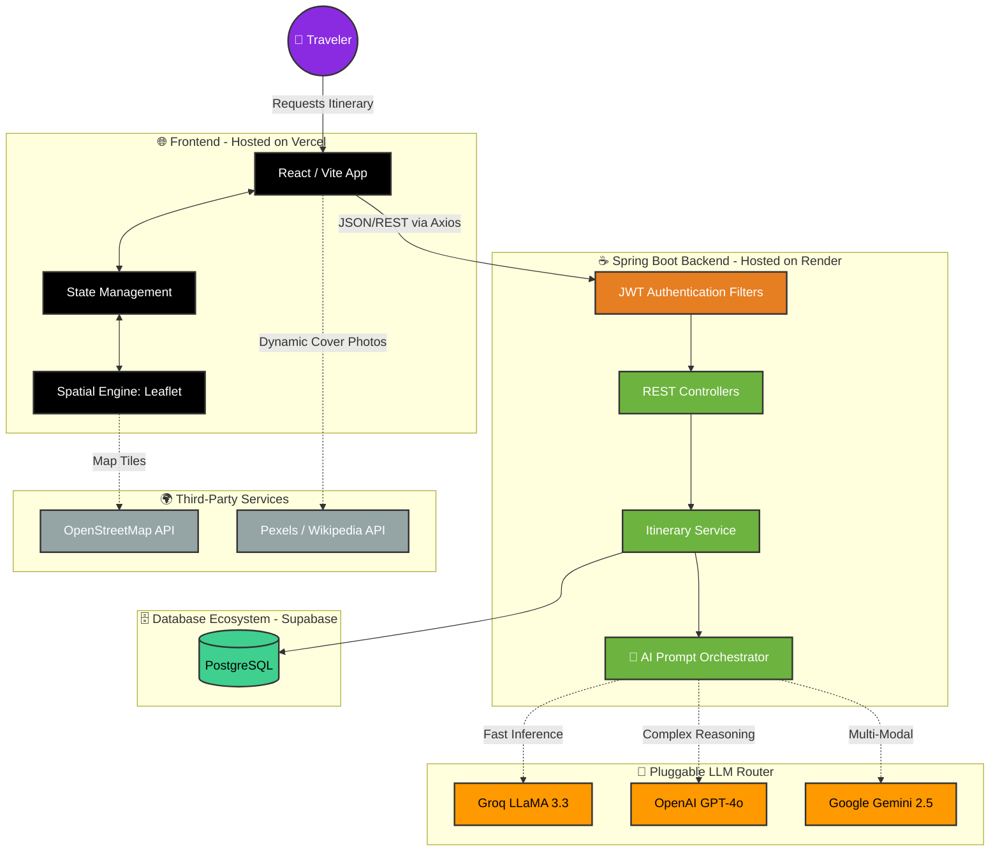

<div align="center">
  <h1>🌍 Lumina (AI-Tinerary)</h1>
  <p><strong>The Future of AI-Powered Travel Planning</strong></p>

  [](https://openjdk.org/)
  [](https://spring.io/projects/spring-boot)
  [](https://react.dev/)
  [](https://postgresql.org/)
  [](https://vercel.com/)
  [](https://render.com/)
</div>

<br/>

## 🤖 What is it doing?

Lumina is a full-stack, production-ready web application that takes the stress out of travel planning by using Large Language Models to generate highly detailed, personalized travel itineraries in seconds. 

Here is exactly what happens under the hood when you hit "Generate Trip":
1. **User Input:** You enter your destination, dates, and preferences into a stunning React glassmorphism UI.
2. **AI Routing:** The Spring Boot backend securely receives the request and dynamically routes it to the most capable AI Provider (Groq LLaMA 3.3, OpenAI GPT-4o, or Google Gemini).
3. **Data Synthesis:** The AI generates a structured JSON response detailing day-by-day activities, estimated costs, safety tips, cultural etiquette, and real-world map locations.
4. **Interactive Visualization:** The frontend parses this data and renders it onto interactive UI cards and a dynamic Leaflet map, allowing you to visually explore your trip!
5. **Smart Fallback Imagery:** High-quality imagery is dynamically fetched for every location using Pexels API, with intelligent fallbacks to Wikipedia's open image databases.

---

## 🏗️ Project Architecture Pipeline



---

## 🚀 Production Deployment

This application is fully containerized and deployed to the cloud:
* **Frontend:** Deployed globally on **Vercel's** Edge Network for sub-second load times.
* **Backend:** Hosted as a Web Service on **Render**, utilizing Docker and Java 17.
* **Database:** Powered by **Supabase PostgreSQL**, utilizing Flyway for automated schema migrations.

---

## 💻 Step-by-Step Local Setup

Want to run this locally on your own machine? Follow these exact steps:

### Prerequisites
*   **Java 17** or higher
*   **Node.js** (v18+) and **npm**
*   Get a free API key from [Groq](https://console.groq.com/) or [Google Gemini](https://aistudio.google.com/)
*   A local PostgreSQL database or Supabase connection string.

### Step 1: Clone the Repository
```bash
git clone https://github.com/AbdulKalamU/Ai-tinerary.git
cd Ai-tinerary
```

### Step 2: Configure Environment Variables
1. Create a copy of the example environment file:
   ```bash
   cp .env.example .env.local
   ```
2. Open `.env.local` and paste your Groq or Gemini API key. 
3. Configure your `DB_USERNAME`, `DB_PASSWORD`, and `DB_HOST` to point to your local PostgreSQL instance.

### Step 3: Start the Spring Boot Backend
Our Java backend uses Maven. Run the wrapper (`mvnw`) to automatically download dependencies and start the server:
```bash
# Run this command in the root Ai-tinerary directory
./mvnw spring-boot:run
```
*The backend is now securely running on `http://localhost:8080`!*

### Step 4: Start the React Frontend
Open a **new terminal tab** and navigate to the frontend directory:
```bash
cd frontend-react
npm install
npm run dev
```
*Vite will start the frontend at `http://localhost:5173`. Open that link in your browser!*

---

## 🌟 Future Roadmap

*   **📄 Export to PDF:** Allow users to generate a beautiful, branded, and printable PDF of their day-by-day travel plan.
*   **🤝 Collaborative Editing:** Integrating WebSockets to allow multiple friends to view and drag-and-drop activities on the same itinerary in real-time.
*   **🌦️ Live Weather Integration:** Connecting to the OpenWeatherMap API to inject the actual weather forecast for the specific trip dates into the UI.

---

## 📄 License
This project is licensed under the **MIT License**.
