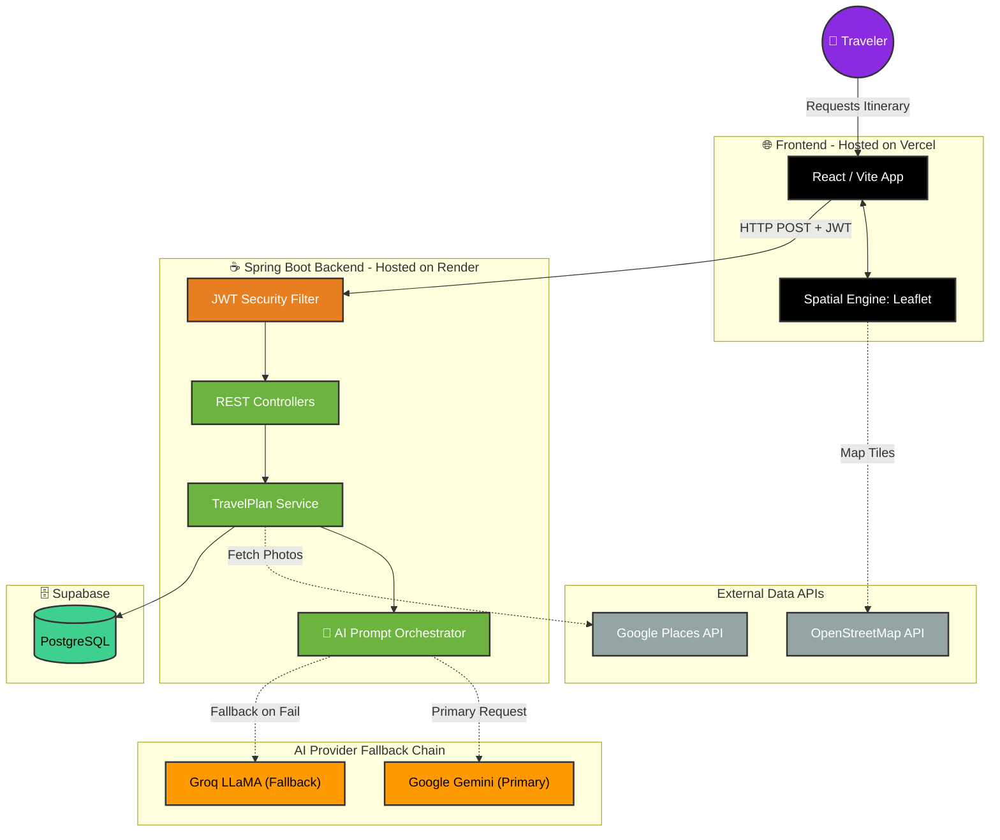

<div align="center">
  <br />
  <h1>🌍 AI Travel Planner</h1>
  <p><strong>An Intelligent, Full-Stack Travel Orchestration Platform</strong></p>

  [](https://openjdk.org/)
  [](https://spring.io/projects/spring-boot)
  [](https://react.dev/)
  [](https://postgresql.org/)
  [](https://vercel.com/)
  [](https://render.com/)
</div>

<br/>

## 📖 Overview

Traditional travel planning is highly fragmented, forcing users to juggle multiple tabs across blogs, maps, and budgeting tools. **AI-Tinerary** solves this by leveraging Large Language Models (LLMs) to generate highly detailed, personalized, day-by-day travel itineraries in seconds.

Built with a decoupled **React** frontend and an enterprise-grade **Java Spring Boot** REST API, this platform showcases advanced backend orchestration, relational database design, secure authentication, and resilient API fallback mechanisms.

---

## ✨ Core Features & Engineering Highlights

### 1. AI Orchestration & Fallback Resilience
The backend integrates with both **Google Gemini** and **Groq (LLaMA 3.1)** APIs. Using a custom `ModelRouter`, the system employs a resilient fallback mechanism. If the primary AI provider experiences downtime or rate limits, the request is instantly rerouted to the secondary provider, ensuring 99.9% uptime for the user without any visible error screens.

### 2. Relational Database & Entity Cascading
Powered by **Supabase PostgreSQL**, the database schema is highly relational (`User` → `TravelPlan` → `ItineraryDay` → `Activity`). Utilizing **Hibernate/JPA**, the backend enforces strict referential integrity. Deleting a travel plan automatically cascades to remove all associated days and activities (`orphanRemoval = true`), eliminating orphaned data and optimizing storage.

### 3. JWT Stateless Authentication
Security is enforced using **Spring Security**. User passwords are encrypted via **BCrypt** before database persistence. Client-server sessions are authorized using stateless **JSON Web Tokens (JWT)**, intercepting and verifying the signature on every secure HTTP request.

### 4. Interactive Spatial Mapping
The frontend integrates **Leaflet.js** and **OpenStreetMap**. As the AI generates specific activities, the exact latitude and longitude coordinates are parsed and dynamically plotted as interactive markers on a sticky map panel alongside the itinerary timeline.

### 5. Google Places API Integration
To provide high-quality visual context, the application queries the **Google Places API** to dynamically fetch beautiful, location-specific photography for every generated tourist attraction and restaurant on the itinerary.

---

## 📸 Application Showcase

> **Note to recruiters/developers:** 
> *Please refer to the repository assets for high-quality screenshots of the working application.*

<div align="center">
  
  <p><em>The landing page.</em></p>

  <br/>

  
  <p><em>Dashboard.</em></p>
</div>

---

## 🏗️ Project Architecture



---

## ⚙️ DevOps & CI/CD Pipeline

To ensure production stability, the repository uses **GitHub Actions** for Continuous Integration.
1. **Automated Testing:** On every `git push`, the CI pipeline runs a suite of backend unit tests (**JUnit 5** & **Mockito**) and frontend End-to-End browser tests (**Cypress**).
2. **Automated Deployment:** Upon passing tests, webhooks automatically trigger new production builds on **Vercel** (frontend) and **Render** (backend).

---

## 💻 Local Setup Guide

Follow these steps to run the project locally on your machine.

### Prerequisites
*   **Java 17** or higher
*   **Node.js** (v18+)
*   An API key from [Google Gemini](https://aistudio.google.com/) or [Groq](https://console.groq.com/)
*   A local PostgreSQL database or Supabase connection.

### Step 1: Clone & Configure
```bash
git clone https://github.com/AbdulKalamU/Ai-tinerary.git
cd Ai-tinerary
```
Open `src/main/resources/application.properties` and add your database credentials and API keys.

### Step 2: Start the Java Backend
```bash
# Downloads Maven dependencies and starts the Spring Boot server on port 8080
./mvnw spring-boot:run
```

### Step 3: Start the React Frontend
Open a new terminal tab and run:
```bash
cd frontend-react
npm install
npm run dev
```
*The application will now be running at `http://localhost:5173`!*

---
<div align="center">
  <p>Built with ❤️ for travelers everywhere.</p>
</div>
