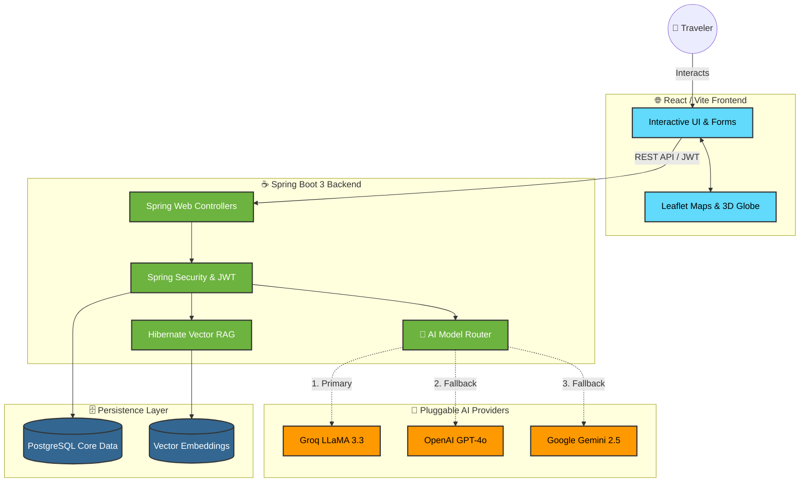

<div align="center">
  <h1>🌍 AI-Tinerary</h1>
  <p><strong>The Future of AI-Powered Travel Planning</strong></p>

  [](https://openjdk.org/)
  [](https://spring.io/projects/spring-boot)
  [](https://react.dev/)
  [](https://postgresql.org/)
</div>

<br/>

AI-Tinerary isn't just another travel app—it's a **context-aware, highly-resilient travel architect**. By leveraging multiple Large Language Models and a custom Retrieval-Augmented Generation (RAG) pipeline, it instantly synthesizes complex travel variables into beautiful, interactive, and personalized itineraries.

---

## 🏗️ Project Architecture Pipeline

GitHub natively renders this architecture diagram! It showcases how our modern stack handles data flow from the user all the way to our dynamic AI fallback router.



---

## 🚀 Step-by-Step Quick Start

Want to run this beast locally? Follow these simple steps.

### Step 1: Clone & Configure
First, get the code on your local machine and set up your environment variables.
```bash
git clone https://github.com/AbdulKalamU/Ai-tinerary.git
cd Ai-tinerary
cp .env.example .env.local
```
> 🔑 **Important:** Open `.env.local` and add at least one AI API key (Groq, OpenAI, or Gemini) and a secure JWT Secret string.

### Step 2: Ignite the Backend
Our Java Spring Boot server handles all the heavy lifting, security, and AI routing.
```bash
# Run the Maven wrapper to start the Spring Boot app
./mvnw spring-boot:run
```
*The backend will boot up on `http://localhost:8080`. It uses an in-memory H2 database by default, so no local SQL installation is required!*

### Step 3: Launch the Frontend
In a **new terminal window**, spin up the React interface.
```bash
cd frontend-react
npm install
npm run dev
```
*The Vite dev server will start at `http://localhost:5173`. Open this in your browser to see the magic.*

---

## 🤝 How to Contribute

This is an open-source project and we would absolutely love your help! Whether you want to improve the AI prompts, add new 3D globe features, or fix a CSS bug, here is how you do it:

1. **Fork** this repository to your own GitHub account.
2. **Clone** your fork to your computer.
3. **Create a branch** for your feature: `git checkout -b feature/MyAwesomeFeature`
4. **Code your heart out!**
5. **Commit your changes**: `git commit -m 'Added an awesome feature'`
6. **Push to your fork**: `git push origin feature/MyAwesomeFeature`
7. **Open a Pull Request** back to our `main` branch.

### 🌟 What we need help with right now:
* Replacing H2 database with full PostgreSQL support in Docker.
* Adding a "Download to PDF" feature for generated itineraries.
* Improving the mobile-responsiveness of the 3D globe.

## 📄 License
This project is open-source and licensed under the **MIT License**. Feel free to use it, break it, and build upon it!
