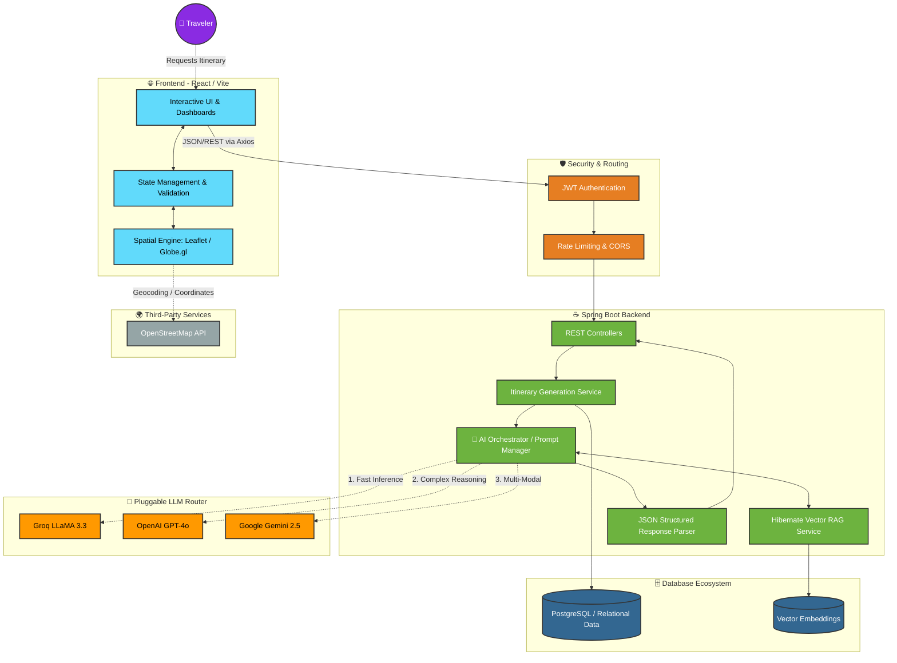

<div align="center">
  <h1>🌍 AI-Tinerary</h1>
  <p><strong>The Future of AI-Powered Travel Planning</strong></p>

  [](https://openjdk.org/)
  [](https://spring.io/projects/spring-boot)
  [](https://react.dev/)
  [](https://postgresql.org/)
</div>

<br/>

## 🤖 What is it doing?

AI-Tinerary is a full-stack web application that takes the stress out of travel planning by using Large Language Models to generate highly detailed, personalized travel itineraries in seconds. 

Here is exactly what happens when you hit "Generate Trip":
1. **User Input:** You enter your destination, dates, and preferences in the React frontend.
2. **AI Routing:** The Spring Boot backend receives the request and dynamically routes it to the most capable, available AI Provider (Groq LLaMA 3.3, OpenAI GPT-4o, or Google Gemini).
3. **RAG Context:** Before asking the AI, the backend uses `hibernate-vector` to fetch specific local knowledge (like hidden gems or cultural norms) from our vector database and injects it into the prompt.
4. **Data Synthesis:** The AI generates a structured JSON response detailing day-by-day activities, estimated costs, and real-world map coordinates.
5. **Interactive Visualization:** The frontend parses this data and renders it onto a 3D interactive globe and 2D Leaflet maps, allowing you to visually explore your trip!

---

## 🏗️ Project Architecture Pipeline



---

## 🚀 Step-by-Step Local Setup

Want to run this locally on your own machine? Follow these exact steps:

### Prerequisites
Before you start, make sure you have installed:
*   **Java 17** or higher
*   **Node.js** (v18+) and **npm**
*   Get a free API key from [Groq](https://console.groq.com/) or [Google Gemini](https://aistudio.google.com/)

### Step 1: Clone the Repository
Open your terminal and download the code to your machine:
```bash
git clone https://github.com/AbdulKalamU/Ai-tinerary.git
cd Ai-tinerary
```

### Step 2: Configure Environment Variables
The app needs your API keys to talk to the AI.
1. Create a copy of the example environment file:
   ```bash
   cp .env.example .env.local
   ```
2. Open `.env.local` in any text editor.
3. Paste your Groq or Gemini API key into the respective field. 
4. Add a random long string for the `JWT_SECRET` (this is used to secure user logins).

### Step 3: Start the Spring Boot Backend
Our Java backend uses Maven. You don't even need to install Maven yourself, it comes with a wrapper (`mvnw`) that handles it for you!
```bash
# Run this command in the root Ai-tinerary directory
./mvnw spring-boot:run
```
*Wait until you see `Started AiTineraryApplication` in the console. The backend is now securely running on `http://localhost:8080`! (It automatically uses a local H2 database, so no SQL setup is needed).*

### Step 4: Start the React Frontend
Open a **new terminal tab** (leave the backend running in the first one) and navigate to the frontend directory:
```bash
cd frontend-react

# Install all the necessary frontend libraries
npm install

# Start the Vite development server
npm run dev
```
*Vite is incredibly fast. Within seconds, it will tell you the frontend is running at `http://localhost:5173`. Open that link in your browser!*

### Step 5: Test it out!
1. Open `http://localhost:5173` in your browser.
2. Create a new account on the login page.
3. Enter a dream destination like "Tokyo, Japan" for a 5-day trip.
4. Watch the AI generate your highly detailed travel itinerary!

---

## 📄 License
This project is licensed under the **MIT License**.
